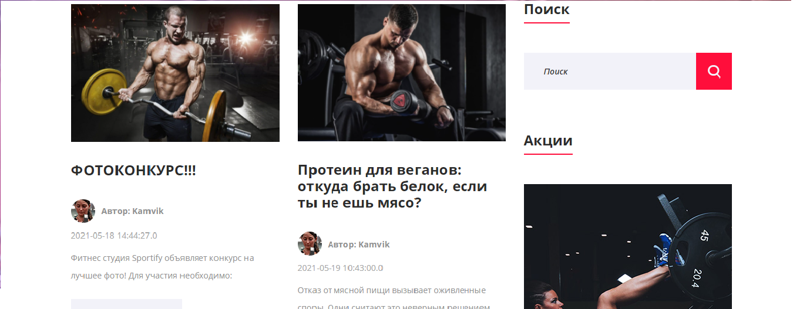
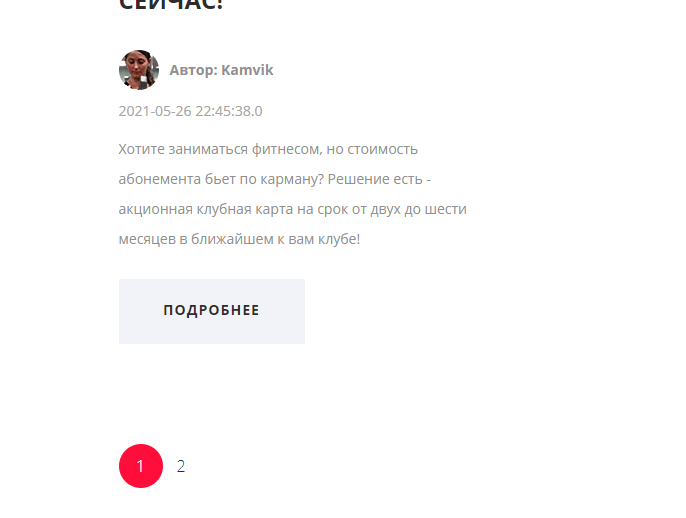
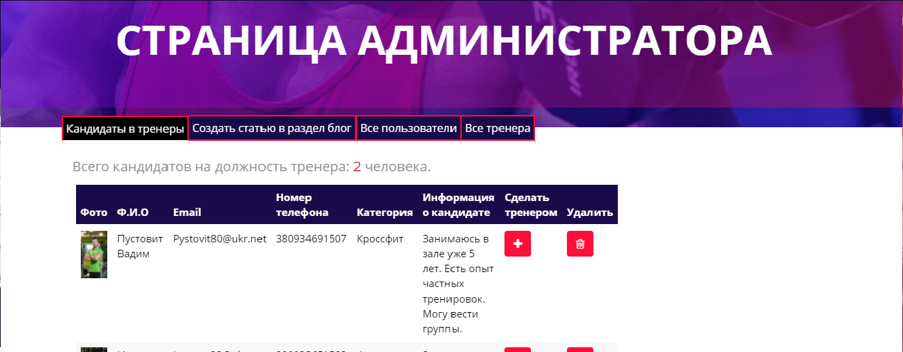
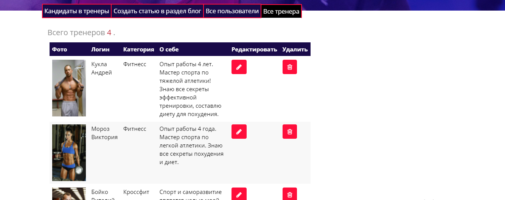
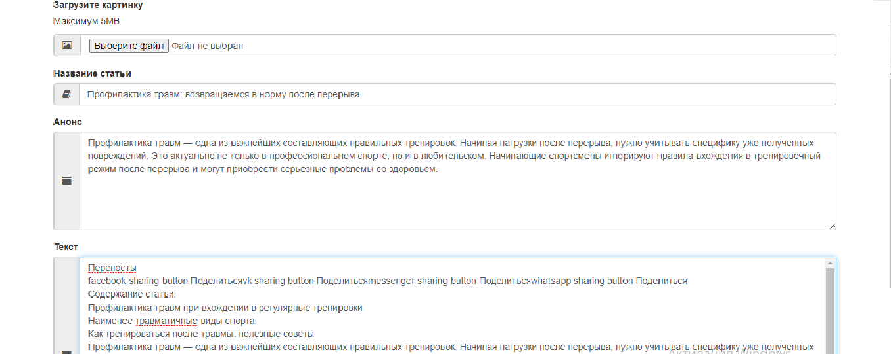
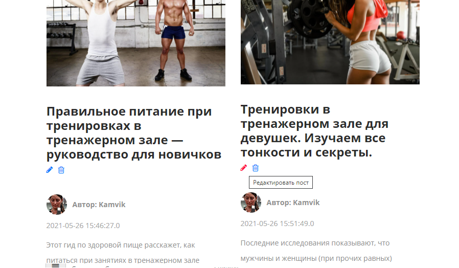
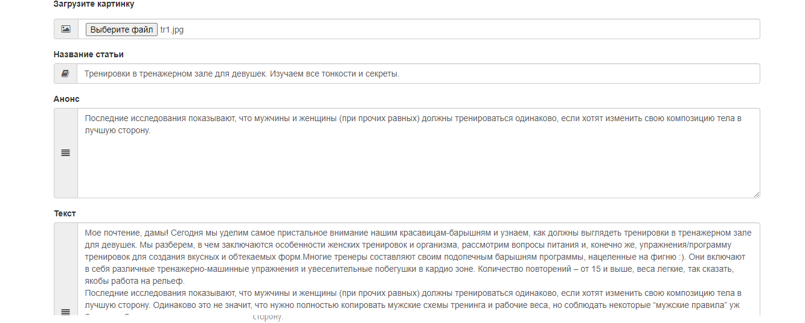

# Sportify_Spring_Project
The project used such technologies and libraries:
* Spring
 1. Spring-boot
 1. Spring-security
* Hibernate
 1. Hibernate-validator
* Thymeleaf
* Lombok
* Bootstrap
***
1. The main activity of the application looks like this.When a user logs in for the first time, the system identifies him as anonymous.

2. Then the user can register on the site.

3. If the user enters incorrect data, site validation will work.

4. After successful registration it will be redirected to the login page.

5. After successful authorization, the user goes to the main page, where the site already defines his role and login. The login is displayed in the menu.

6. The blog section displays articles.

7. Search by keyword will find the article the user needs.

8. For more convenient display of articles on the site, pagination is provided.

9. If a user wants to work in this gym, he can fill out a special form and become a candidate. After that, the result of the completed form will be sent to the site administrator, who, in turn, can approve the candidate and make him a trainer in the gym, or reject and remove him from the candidates section.

10.That's all for a regular user, let's go to the site administrator. When a user with the administrator role enters the site, a section for the administrator is added to his menu.

11.There are 4 tabs on the admin page: displaying all candidates for a trainer, the ability to add a new article, a list of all registered users and a list of active trainers in the gym.

12.In the section all trainers, you can edit the data of the trainer. If the trainer is no longer working, then there is an opportunity to delete it.

13.In the add a new article section there will be a form for filling out information about the article.

14.The administrator can also edit or delete any article.

15. Article editing form.
 
